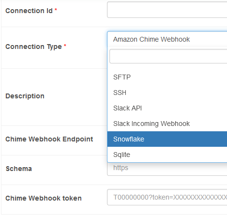
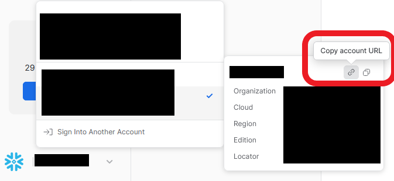

# airflow_snowflake 정리
airflow에서 snowflake 연결을 하는 방법을 정리했습니다. 

## 1. snowflake-provider 설치하기

: `apache-airflow-providers-snowflake==5.2.1` ****를 설치하여 진행하였습니다. 해당 패키지 설치를 위한 요구사항들은 아래 표와 같습니다.

| PIP package | Version required |
| --- | --- |
| apache-airflow | >=2.6.0 |
| apache-airflow-providers-common-sql | >=1.10.0 |
| snowflake-connector-python | >=2.7.8 |
| snowflake-sqlalchemy | >=1.1.0 |

- Airflow: 기존 2.5.1 버전에서 2.8.0 버전으로 버전업을 진행하였습니다.
- 나머지 모듈 설치 : `_PIP_ADDITIONAL_REQUIREMENTS: ${_PIP_ADDITIONAL_REQUIREMENTS:- pandas apache-airflow-providers-common-sql snowflake-connector-python snowflake-sqlalchemy apache-airflow-providers-snowflake}`

## 2. 실행 후 연결하기 - Connections

1.  Connection Type에 snowflake provider를 선택합니다.

    

1. 다음 필드들을 채워야합니다.
    - Connection Id: `snowflake_conn`
    - Warehouse, Database, Schema: 연결할 warehouse, db, schema 정보들을 입력합니다.
    - Login: 로그인 시 사용되는 username
    - Password: 로그인 시 사용되는 password
    - Account & Reigon: 아래의 사진에서 Copy account URL 버튼을 눌러 자신의 URL을 복사합니다. 그 결과는 `https://<account_name>.<Region>.snowflakecomputing.com`과 같이 나오기에 맞춰서 작성해주시면 됩니다.
        - 저는 aws서버로 진행하였는데 region에서 `.aws`를 붙이지않아 에러가 발생했던 경우가 있었습니다.
        - 관리자 계정의 경우 접속이 잘 안되는 경우가 있는데 airflow용 전용 계정을 생성하여 해결하였습니다.
    
    
    
    - Role: 접속 계정의 Role을 작성해주시면됩니다.

### 참고

- [Airflow-Providers 사용방법](https://heumsi.github.io/apache-airflow-tutorials-for-beginner/dags/07-providers/#provider-package-%E1%84%86%E1%85%A9%E1%86%A8%E1%84%85%E1%85%A9%E1%86%A8)
- [pip-apache-airflow-providers-snowflake](https://pypi.org/project/apache-airflow-providers-snowflake/)
- [연결 및 테스트 - snowflake community](https://community.snowflake.com/s/article/How-to-connect-Apache-Airflow-to-Snowflake-and-schedule-queries-jobs)