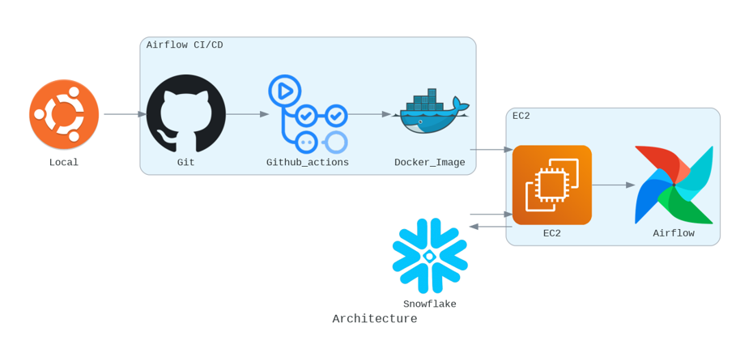

# 데브코스 3차 프로젝트 (2)
프로젝트 기간 : 01/08 ~ 01/12 (5일)

## 프로젝트 주제

기상 정보에 따른 서울시 자전거 대여 현황을 파악할 수 있도록 데이터 파이프라인을 구성하고 이를 시각화

## 주제 선정이유 및 기대효과

적은 전처리와 Update 주기가 빠른 데이터를 사용하여 ETL 파이프라인 구축 경험을 위함

이 데이터들의 파이프라인을 통한 시각화로, 날씨정보와 서울시 공공자전거 현황을 함께 확인하여 사용자들의 편리한 이용에 도움을 줄 수 있음

## 프로젝트 인원 및 나의 역할
나를 포함한 5인이 진행하였다.
### 팀장의 역할을 맡게 되었다. 
전반적인 프로젝트 프로세스를 관리하였으며, 팀 인원들의 역할을 분배하고, 각자의 역할에 대한 진행상황을 체크하였다. 또한, 프로젝트의 진행상황을 매일 회의를 통해 공유하였다.
### Git, DataWarehouse, Docker 관리
프로젝트 전반 Git을 관리하였으며, Docker를 사용해서 Airflow 커스텀 이미지를 생성하는 과정을 전담하였다. 또한 Snowflake를 사용해서 DataLake와 DataWarehouse를 사용 가능하도록 구축하는 역할을 수행하였다.

## 프로젝트 아키텍처
 
 
- ec2
    - Docker로 Airflow, Superset container 실행하기 위함
    - 사양 - **Instance type** : **t3a.xlarge**(4 vCPU, 16GiB)

- airflow
    - 개인 local에서 테스트 후 최종 DAG 사용

- snowflake
    - redshift 비용문제로 snowflake 30일 무료제공 계정 사용
    - 분석용 데이터(data warehouse), raw데이터(data lake) 모두 적재

## 프로젝트 진행과정
### 데이터 수집
: 서울시 실시간 도시 데이터 API를 활용해서 데이터를 수집하였다.

- 수집 데이터 목록

  | 실시간 자전거 대여정보 | 실시간 날씨정보 |
  | --- | --- |
  |자전거 대여소명| 온도|
  |자전거 대여소ID| 체감온도|
  |자전거 주차 건수| 강수량|
  |자전거 거치대수| 강수확률|
  |자전거 거치율| 자외선 지수|
  ||미세먼지농도|
  ||초미세먼지농도|

### ETL 구성

### ELT 구성
: 데이터 수집 목적에 맞게 두 분류로 나누어 DAG를 구성하였다.

- 일자별 데이터 정리 및 요약

  

- 주간 데이터 시각화를 위한 테이블

  

### 시각화 대시보드 구성

- 현재 기온, 강수확률, 평균 따릉이 거치율을 표시

  

- 서울 주요지역별 구체적인 기상정보 확인가능
  

- 장소별 따릉이 거치소의 구체적 현황 확인가능

  

## 코드
자세한 코드는 GIT REPOSITORY를 참고해주세요!: https://github.com/K-bike-DE/airflow_dev

---
### 이전 포스트
- [데브코스 3차 프로젝트 (1)](https://poriz.github.io/dataengineering/camp/2024-01-09-dataengineering-camp-project3_1/)

### 다음 포스트
- [빅데이터 처리 시스템, Hadoop](https://poriz.github.io/dataengineering/camp/2024-01-16-dataengineering-camp-Spark_1/)

