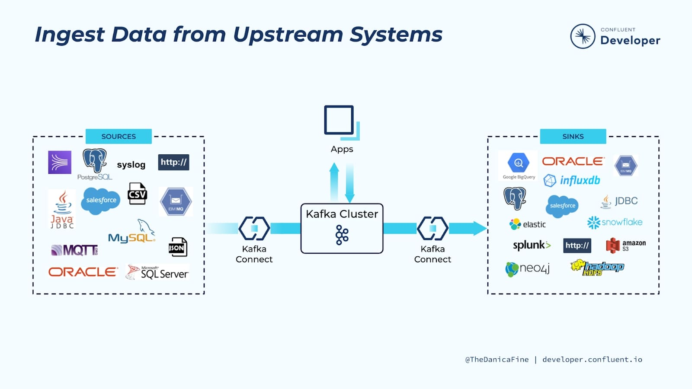

# Kafka - 소개 & 개념

## Kafka란?

실시간 데이터를 처리하기 위해 설계된 오픈소스 분산 스트리밍 플랫폼.

- Scalability와 Fault Tolerance를 제공한다. → Publish-Subscription 메시징 시스템.
- 기존 메시징 시스템과의 비교
    - 카프카는 메시지를 보유 기간 동안 저장한다.
    - 메시지의 생산과 소비를 분리 → 독립적 작업이 가능
    - 높은 처리량과 저지연 데이터 스트리밍을 제공한다.
    - 한 파티션 내에서는 메세지 순서를 보장해준다.
        - Eventually Consistent → 전파 시간에 따라 데이터를 읽는 것을 장담 불가
        - Strong Consistency ⇒ 완전한 파일 읽기 가능.
        - 이것이 발생하는 원인은 다수의 서버로 구성된 시스템이기 때문이다. (복제중)

## Kafka의 중요 개념들

### Message(Event)

- 1 Message = 1MB
- key 자체로도 복잡한 구조를 가질 수 있다.

### Topic

- key, value, timestamp, headers로 이루어져있다.
- Consumer가 데이터를 읽는다고 없어지지 않는다.
- Consumer 별로 어느 위치의 데이터를 읽고 있는지 위치 정보를 유지한다.
- Fault Tolerance를 위해서 이 정보가 중복 저장된다.

### Partition

- 하나의 Topic은 확장성을 위해 다수의 Partition으로 나누어 저장된다.
- 복제본: 소비의 병렬성을 위해서도 복제본을 사용하게된다.
    - 데이터를 쓰는 작업은 리더를 통해서 이루어지며
    - 데이터를 읽는 작업은 리더나 팔로워 중에 선택해서 이뤄진다.
    - Consistency Level은 파티션 별로 설정이 가능하다.

### Segment

- 하나의 Partition은 다수의 Segment로 구성된다. ⇒ Segment는 추가만 되는 log file
- 각 Segment는 디스크상에 존재하는 하나의 파일이며, 최대 크기가 있어 이를 넘어가면 새로운 파일을 생성한다.
- 항상 뒤에 데이터가 쓰여지며(Append only), 불변하는 데이터이다.

### Broker

- 실제 데이터를 저장하는 서버이다.
- Kafka 클러스터는 다수의 brocker로 구성된다.
- 토픽과 파티션들을 실제로 관리하는것이 broker이다.
    - Producer가 Message들을 Broker로 전송하면 이를 Partition으로 나누어 분산 저장한다.
    - 저장된 Partition과 Replica의 관리는 Controller가 수행한다.
- 클러스터의 용량을 늘리는 경우에는 broker의 수를 늘리는 것!
- Consumer는 Broker를 통해서 메세지를 읽는다.

### Controller

- Zookeeper 모드
    - 하나의 controller가 존재하며, controller가 zookeeper를 통해 메타데이터 관리와 리더 선출을 담당한다.
    - 장기적으로 사용을 최소화해나가는 추세이다.
- KRaft 모드
    - Controller가 Zookeeper를 배제하고 그 역할을 대신 수행한다.
    - 다수의 Controller가 존재.

### Producer

- 하나의 Topic은 다수의 Partition으로 구성되는데 이를 Producer가 결정하게된다.
- 두가지 용도로 사용되는데
    1. Load Balancing ⇒ 부하 분산
    2. Semantic Partitioning ⇒ 특정 키를 가지고 레코드를 분리
- 메세지가 어느 partition에 속하는지 결정하는 것은 키의 유무에 따라 달라진다.
    - 키가 있는 경우에 hashing 값을 partition의 수로 나눈 후 나머지를 결정한다.

### Consumer

- Topic을 기반으로 Message를 읽어들인다. → Subscription
- Offset을 이용해서 마지막에 읽어들이 Message 위치정보를 유지한다.
- Consumer Group 을 통해서 Scaling 구현
- Consumer는 다시 토픽을 만들기도 한다. (Producer 역할)

## Kafka의 기타 기능들

### Kafka Connect

- kafka 위에 만들어진 중앙집중 데이터 허브.
    - 별도의 서버들이 필요함. or Broker들 중 일부도 가능
- Task들을 Worker들이 수행한다.
    - Source Task, Sink Task
- 외부데이터 → 이벤트 스트림, 내부 데이터 → 외부로 내보내기
- 데이터 시스템들 간의 데이터를 주고 받는 용도로 Kafka를 사용
    - 데이터 소스와 데이터 싱크

 

### Schema Registry

Topic Message Data에 대한 스키마를 관리 및 검증에 사용한다.

- Producer와 Consumer는 Schema Registry를 사용해서 스키마의 변경을 처리한다.
- Producer가 메세지 전송시 Serialization을 해서 전송하고 Consumer가 송신시 Deserialization을 수행한다.
    - Serialization: 직렬화, 객체를 저장 or 전송할 수 있는 형태로 변환하는 프로세스, 압축이 되거나 스키마 정보가 추가된다.
    - Deserialization: 역직렬화, 직렬화된 데이터를 사용할 수 있는 형태로 변환, 스키마 정보가 있다면 데이터 포맷의 검증도 가능하다.
- Schema ID를 사용해서 다양한 포맷 변천을 지원한다.
    - AVRO를 보통 데이터 포맷으로 사용한다. → Schema 임베드가 가능, (Protobuf, JSON등도 사용된다.)
- 포맷 변경 처리 방법
    - Forward Compatibility: Producer부터 변경, Consumer는 점진적 변경
    - Backward Compatibility: Consumer부터 변경, Producer는 점진적 변경
    - Full Compatibility: 둘다 변경된다.
- Kafka 라이브러리를 사용해서 Producer와 Consumer를 생성하는 경우에 자동으로 위의 과정을 진행하게 된다.

### REST Proxy

- 클라이언트가 API 호출을 이용해서 Kafka를 사용 가능하게 해준다.
- 외부의 네트워크에서 Kafka를 접근해야할 필요성이 있는 경우에 유용하다.

### Kafka Streams

Kafka Topic을 소비하고 생성하는 실시간 스트림 처리 라이브러리이다. 

Spark Streaming으로 topic을 처리하는 경우에 micro batch에 가까우나, kafka streams로 처리하는 것은 Realtime에 더 가깝다.

- ksqlDB: kafka streams로 구현된 스트림 처리 데이터베이스.
    - SQL 기본 기능들을 지원한다.
    - 연속쿼리를 지원하는데 이는 데이터가 실시간으로 도착하는 경우 지속적으로 작업을 처리한다.
    - 지속적으로 업데이트되는 뷰를 지원한다.
---
### 이전 포스트
- [Kafka - 실시간 데이터 개요](https://poriz.github.io/dataengineering/camp/2024-01-22-dataengineering-camp-Kafka_1/)
### 다음 포스트
- - [Kafka - 기본 프로그래밍](https://poriz.github.io/dataengineering/camp/2024-01-25-dataengineering-camp-Kafka_3/)

